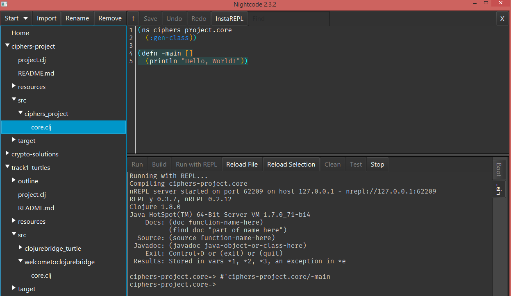

# Overview of Clojure. 

## Principles of functional languages

Clojure is a functional language. This means that rather 
than updating variables in memory, programs work by function composition. Functions in a functional language are treated as other elements of the language (numbers, strings, etc.), i.e. they can be stored in a variable, passed to other functions, returned from other functions, and even created at run time. This is often refers to as *functions being first class citizens in the language*. 

Variables and data structures in Clojure are immutable by default, i.e. they never change in place. Every time a modification is needed, a new object is created. For instance, if you add an element to a list, a new list is created with the new element added, and the old list stays the same. 

This may seem like an inefficient approach, but underneath there is a very efficient sharing of the parts that didn't change, but it's invisible to the programmer. Clojure vectors are in particular efficient in this sense. 

The benefit of immutability is that it is easier to know exactly what's happening in a program since every object that a program references is always the same as when it was originally created. This also makes it easier to incorporate concurrency since there is much less of a need to keep track of simultaneous updates, so much less of a need to lock objects. In fact, one of the main design goals of Clojure was the ease of concurrent programming with minimal locking. 

## Clojure and Java

Clojure compiles into Java bytecode and runs on Java Virtual Machine (JVM). There is a convenient way to call Java methods and use Java libraries in Clojure. This means that Clojure can use any predefined Java functionality. 

Since Clojure is implemented on top of Java, Clojure objects (numbers, strings, lists, etc.) are implemented as Java datatypes. 
Unfortunately, this also means that Clojure error messages are Java exceptions and refer to Java datatypes. This makes them less understandable to those not familiar with Java. We will try to help you navigate through error messages if they become confusing. 

## Clojure Syntax 

Clojure is a language in the Lisp family. Lisp languages are functional, dynamically typed languages with a simple uniform syntax. In Lisp languages there are a handful of keywords (such as Clojure `def` for defining a variable) and no predefined operations: even arithmetic operations, such as `+`, `-`, etc. are functions in Clojure. 

Clojure syntax follows prefix notation: a Clojure expression is surrounded with parentheses, the first element in the parentheses is a function name, and what follows is the function arguments:
```clojure
(+ 2 5)
```
is the call to a function `+` with the arguments `2` and `5`, which returns `7`. 

Many functions in Clojure take a variable number of arguments: 
```clojure
(+ 2 5 3)
```
passes three arguments to `+`, and returns `10`. 

Since functions in Clojure are first-class citizens, they can be passed to other functions. For instance,
```clojure
(filter odd? [2 3 -1 8])
```
is a call to a function `filter` that takes a function that returns true/false values and a collection of elements, and returns a new collection that only contains the elements for which the function returned `true`. In this case, only the elements `3` and `-1` will be in the resulting collection. 

All languages have their own naming and formatting conventions. Clojure (and other Lisp languages) use the following:

* Multi-word variable names use dashes, not underscores or camel-casing: `find-min-key`.
* Function names tend to be verbs, not nouns: `take`, `reduce`, etc.
* Names of functions that return boolean (true/false) values end with a question mark: `odd?`, `number?`. 
* Parentheses all close on the last line of a nested expression, as in the follwoing function definition: 
```clojure
(defn square
  [x]
  (* x x))
```

Comments start with `;` and go until the end of the line:
```clojure
(def n 10) ; n is the number of elements
```
Traditionally we use `;;` to start a comment that takes the 
entire line. 

For more on Clojure style please see [The Clojure Style Guide](https://github.com/bbatsov/clojure-style-guide) (and you might want to revisit this link after you are done with this lesson). 

## Clojuredocs 

Clojure has excellent documentation that was put together by Clojure programmers: [Clojuredocs: community-powered documentation and examples repository](https://clojuredocs.org/)

Most of the functions you will be using are listed in [Clojuredocs Quick Reference](https://clojuredocs.org/quickref). The lesson provides links to functions used in each subsection. 

Documentation for each function comes with a list of examples, related functions at the bottom of the page, and even some comments and discussion. Examples have both straightforward common cases and unusual edge cases (if applicable). 

We recommend that you take your time to look through the first few examples - and might even try them out! It is quite common to have several browser tabs open with different function descriptions. 

Clojuredocs are very helpful, please use them! 

## Creating a project with Nightcode

Start Nightcode by double-clicking on the Jar file that youn downloaded. After it starts, go to the **Start** menu and select **Console Project**. Choose a location for it (that's where its files will be stored) and a name. **The name must not contain spaces.** By Clojure convention, you may give it a name with a dash, something like `track2-ciphers`. 

Once the project is created, click the arrow with its name, click `src` to open, and then click on the arrow by the folder in it with the same name as the project. You should see the file `core.clj`. Double-click on it to open. 

Your screen should look something like this:


The left panel is a navigation panel for opening and closing files. We will not be using it much, so you might want to make it narrower. 

The right upper panel is where your variables and function definitions go. You may overwrite `-main`, you will not need it. However, you do need to keep the top two lines. 

The lower right panel is the Clojure interpreter. It's running a REPL (Read-Evaluate-Print Loop). This means that you type in Clojure expressions, and it gives you the results. 

Clicking **Run with REPL** will start a REPL for you. Clicking **Reload file** will load all of the definitions from the upper panel (the definitions panel) into REPL so that you can interactively test your functions. Type your Clojure expressions at the prompt (in the example above the prompt is `ciphers-project.core=>`). 

Thus, your process of code development will be like this: 

1. Experiment in REPL (lower right panel) so that you have an idea for what your function is going to be. You can use up arrow to bring the previous expression that you typed in. This is helpful if you want to change it only slightly. 
2. Write the function in the definition panel (upper right panel).
3. Save the file.
4. Load it by clicking "Reload file". 
5. If there are errors, go back into the definition panel, fix them, save, and reload. 
6. When there are no errors, test the function in REPL by calling it on some test data. 
7. If at some point there is an error and the REPL prompt doesn't come back, press "Enter" on the keyboard. If that doesn't help, you would need to reload the file (and in some cases even restart the REPL by clicking "Run with REPL").  

You might want to keep these directions open as you start working on the project. 

## About this lesson

This lesson is intended to be a self-contained introduction to Clojure using fun cipher examples. It walks you through most of the commonly used Clojure functions, gives you an opportunity to write your own through a series of suggested exercises, and finally gives you an example of an encryption to try to break (i.e. attempt to find the key and the decryption) using the tools you have learned. 

Even though the examples are "toy" examples, and not a real-life encryption, the Clojure features and approaches that you learn would be helpful for any data analysis and data processing. 

We encourage you to:

1. Use this lesson as the guide to your learning, not as a rigid set of steps. Take as much time as you want to explore the material, you don't have to finish it or reach any particular milestone. 
2. Try things out. Clojure REPL is a good way to play around with examples. 
3. Ask questions. Mentors are here to answer your questions or explain results that seem confusing or discuss different . 
 
**Next:** [Clojure data types and functions](track2-functions.md)